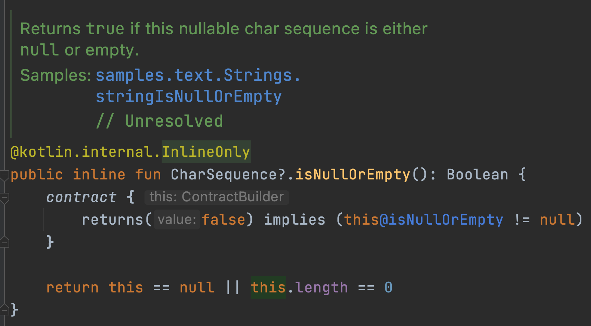
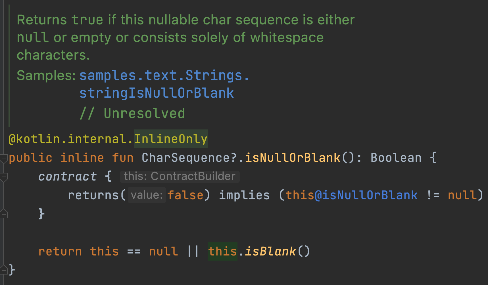
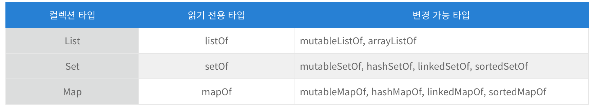
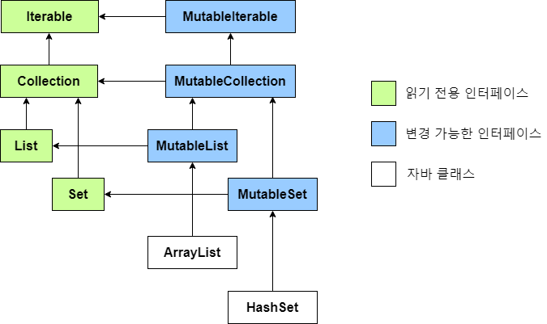

# 6. 코틀린 타입 시스템

---

# 널 가능성

널 가능성은 NullPointerException 오류를 피할 수 있게 도와준다

널이 될 수 있는지 여부를 타입 시스템에 추가

→ 여러가지 오류를 컴파일러가 컴파일할 때 미리 감지해서, 실행 시점에 발생할 수 있는 예외의 가능성을 줄인다

### 널이 될 수 있는 타입

코틀린은 널이 될 수 있는 타입을 명시적으로 지원한다

```java
int strLen(String s) {
	return s.length();
}
**-> 이 함수는 안전할까?
		: null을 넘기면 NPE
-> null인지 검사해야할까?
		: 검사필요 여부는 함수를 사용하는 의도에 따라 달라진다**
```

코틀린에서는 이런 함수를 작성할 때, ‘이 함수가 널을 받을 수 있는가?’를 확인해야 한다

널이 인자로 들어올 수 없다면 👇

```kotlin
fun strLen(**s:String**) = s.length
```

→ 널이 될 수 있는 인자를 넘기면 컴파일 에러가 발생한다

널을 받을 수 있게 하려면

```java
fun strLen(**s:String?**) = s.length
```

물음표를 붙이면? ⇒ null 참조를 저장할 수 있다는 뜻!

Type? = Type or null

널이 될 수 있는 타입의 변수가 있다면, 수행할 수 있는 연산이 제한된다

1. 메소드를 직접 호출할 수 없다
2. 널이 될 수 없는 타입의 변수에 대입할 수 없다
3. 널이 될 수 없는 타입의 파라미터를 받는 함수에 전달할 수 없다

```kotlin
// 1번
fun strLen(s: String?) = **s.length()**

// 2번
****val **x: String?** = null
val **y: String = x**

// 3번
****fun strLen(**s:String**) = s.length
**strLen(x)**
```

null이 아님이 확실한 영역에서는 해당 값을 널이 될 수 없는 타입의 값처럼 사용할 수 있다

null과 비교하고 나면 컴파일러는 그 사실을 기억하고, 널이 될 수 없는 타입의 값처럼 사용할 수 있다

```kotlin
fun strLenSafe(s: String?): Int = **s.length
-> 컴파일 오류**

fun strLenSafe(s: String?): Int = **if (s != null) s.length else 0
-> 컴파일**
```

### 타입의 의미

타입?

어떤 값들이 가능한지와 그 타입에 대해 수행할 수 있는 연산의 종류를 결정한다

자바에서는..

String 타입 : String이나 null

String이나 null이라는 두 가지 종류의 값이 들어갈 수 있다

즉, 자바의 타입 시스템은 널을 제대로 다루지 못한다

- 자바에서 NPE를 다루는 방법

    자바에서는 어노테이션을 사용해 값이 널이 될 수 있는지 여부를 표시할 수 있다

    하지만 표준 자바 컴파일 절차의 일부가 아니라 일관성 있게 적용된다는 보장을 할 수 없다

    이 문제를 해결하는 다른 방법은 null 값을 코드에서 절대로 쓰지 않는 것이다
    null 대신 자바8에 새로 도입된 Optional 타입 등의 null을 감싸는 특별한 래퍼 타입을 활용할 수 있다

    하지만, 코드가 더 지저분해지고, 실행 시점에 성능이 저하될 가능성이 있고, 전체 에코시스템에서 일관성 있게 활용하기 어렵다

널이 될 수 있는 타입과 널이 될 수 없는 타입을 **구분**하면,

1. 각 타입의 값에 대해 어떤 연산이 가능할지 **명확히 이해**할 수 있고,
2. 실행 시점에 예외를 발생시킬 수 있는 연산을 판단할 수 있기 때문에 이런 연산을 아예 금지시킬 수 있다

### 안전한 호출 연산자 ?.

**null 검사**와 **메소드 호출**을 한 번의 연산으로 수행한다


```kotlin
s?.toUpperCase()
// 위를 풀어서 쓰면..
if (s != null) s.toUpperCase() else null
```

주의! 안전한 호출의 결과 타입도 **널이 될 수 있는 타입**이다

프로퍼티를 읽거나 쓸 때도 안전한 호출을 사용할 수 있다

```kotlin
val ceo = Employee("Da Boss", null)
val developer = Employee("Bob Smith", ceo)
println(managerName(developer))
println(managerName(ceo))
```

객체 그래프에서 널이 될 수 있는 중간 객체가 여럿 있다면, 한 식 안에서 안전한 호출을 연쇄해서 함께 사용 가능

( like this.company?.address?.country )

### 엘비스 연산자 ?:

null 대신 사용할 디폴트 값을 지정한다


```kotlin
fun main() {
		println(strLenSafe("abc"))
		println(strLenSafe(null))
}

fun strLenSafe(s: String?): Int = s?.length ?: 0
```

코틀린에서는 return이나 throw 연산도 식이다

따라서 엘비스 우항에 return이나 throw를 넣을 수 있다

```kotlin
class Address(val streetAddress: String, val zipCode: Int, val city: String, val country: String)
class Company(val name: String, val address: Address?)
class Person(val name: String, val company: Company?)

fun printShippingLabel(person: Person) {
    val address = person.company?.address ?: throw IllegalArgumentException("No address")
    with(address) {
        println(streetAddress)
        println("$zipCode $city, $country")
    }
}

fun main() {
    val address = Address("Elsestr. 47", 802342, "Munich", "Germany")
    val jetBranins = Company("JetBrains", address)

    val dmitry = Person("Dmitry", jetBranins)
    printShippingLabel(dmitry)

    val alexey = Person("Alexey", null)
    **printShippingLabel(alexey) // IllegalArgumentException**
}
```

### 안전한 캐스트: as?

as로 지정한 타입으로 변환할 수 없으면 ClassCastException이 발생한다
**as?**는 대상 타입으로 변환할 수 없으면 null을 반환한다


```kotlin
class People(val firstName: String, val lastName: String) {
    override fun equals(other: Any?): Boolean {
        // 타입이 서로 일치하지 않으면 false를 반환
        val otherPeople = other as? People ?: return false

        // 안전한 캐스트를 하고나면 해당 타입으로 스마트캐스트된다
        return otherPeople.firstName == firstName && otherPeople.lastName == lastName
    }

    override fun hashCode(): Int {
        return firstName.hashCode() + 37 + lastName.hashCode()
    }
}

fun main() {
    val p1 = People("Dmitry", "Hemerov")
    val p2 = People("Dmitry", "Hemerov")
    println(p1 == p2)
    println(p1.equals(42))
}
```

### 널 아님 단언 !!

어떤 값이든 널이 될 수 없는 타입으로 (강제로) 바꾼다


근본적으로 !!는

이 값은 null이 아니야. 예외가 발생해도 감수할게

라고 컴파일러에게 말하는 것이다

*그럼 어떨 때 써야 적절한가요?*

"호출된 함수 안에서 널이 아닌 값을 전달받는다는 사실이 **분명하며** 널 검사를 다시 수행하고 싶지 않다!"

→ 이럴 때 적절하다

*여러 !! 단언문을 한 줄에 함께 쓰지 마세요!*

```kotlin
person.company!!.address!!.country
// BAD!
```

스택트레이스에는 어떤 식에서 예외가 발생했는지에 대한 정보가 없다

→ 따라서 !! 단언문을 위처럼 한 줄에 쓰는 것을 피해야 한다

### let 함수

수신 객체가 널이 아닌 경우 람다를 실행해준다


주로, 널이 될 수 있는 값을 널이 아닌 값만 인자로 받는 함수에 넘기는 경우에 많이 사용한다

```kotlin
// 검사해서 널이 아닐 때만 수행
if (email != null) {
    sendEmailTo(email)
}

// let 사용
email?.let { sendEmailTo(it) }
```

여러 값이 널인지 검사해야 한다면 let을 **중첩**시킬 수 있다
하지만 코드가 복잡해지기 때문에, if를 사용해서 검사하는 편이 나을 수도 있다

### 나중에 초기화할 프로퍼티

객체 인스턴스를 일단 생성한 다음에 **나중에 초기화**하려면 어떻게 해야할까?

코틀린에서는, 널이 될 수 없는 프로퍼티를 생성자 안에서 초기화하지 않고 특별한 메소드 안에서 초기화할 수는 없다
초기화 값을 제공할 수 없으면 널이 될 수 있는 타입을 사용할 수밖에 없다
→ 그러려면, 모든 프로퍼티 접근에 널 검사를 넣거나 !!를 써야 한다

나중에 초기화하는 방법 ⇒ lateinit

```kotlin
private **lateinit** var myService: MyService
```

초기화 없이 널이 될 수 없는 프로퍼티를 선언할 수 있다

프로퍼티를 초기화하기 전에 프로퍼티에 접근하면 예외가 발생한다

```
Exception in thread "main" kotlin.UninitializedPropertyAccessException: lateinit property myService has not been initialized
```

### 널이 될 수 있는 타입 확장

널이 될 수 있는 타입에 대한 확장 함수를 정의하면,
어떤 메소드를 호출하기 전에 수신 객체 역할을 하는 변수가 널이 될 수 없다고 보장하는 대신,
직접 변수에 대해 메소드를 호출해도 확장 함수인 메소드가 알아서 널을 처리해준다

예 : isNullOrEmpty, isNullOrBlank

```kotlin
fun verifyUserInput(input:String?) {
    if(**input.isNullOrBlank()**) {
        println("Please fill in the required fields")
    }
}
```

String? 타입의 수신객체에 대해 호출할 수 있는 확장함수

 



안전한 호출 없이도 널이 될 수 있는 수신 객체 타입에 대해 선언된 확장 함수를 호출 가능하다

**this : 자바 VS 코틀린**

자바 : 메소드 안의 this는 항상 널이 아니다

코틀린 : 널이 될 수 있는 타입의 확장함수 안에서는 this가 널이 될 수 있다

let 함수도 널이 될 수 있는 타입의 값에 대해 호출할 수 있지만, let은 this가 널인지 검사하지 않는다

안전한 호출을 사용하지 않고 let을 호출하면, 람다의 인자는 널이 될 수 있는 타입으로 추론된다

```kotlin
val person: String? = null
person.let { sendEmailTo(**it**) }
// -> 컴파일 오류
// Type mismatch.
// Required: String
// Found: String?
```

### 타입 파라미터의 널 가능성

모든 타입 파라미터는 기본적으로 널이 될 수 있다

물음표가 없더라도 널이 될 수 있는 타입이다

```kotlin
fun <T> printHashCode(t: T) {
    // T는 null일 수 **있다**
    println(t**?.**hashCode())
}
```

타입 파라미터가 널이 아님을 확신하고 싶으면, 널이 될 수 없는 타입 상한을 지정해야 한다

```kotlin
fun <**T: Any**> printHashCodeSafe(t: T) {
    // T는 null일 수 **없다**
    println(t.hashCode())
}
```

### 널 가능성과 자바

자바 타입 시스템은 널 가능성을 지원하지 않는다

자바와 코틀린을 조합해서 사용한다면..?

자바에서도 어노테이션을 통해 널 가능성 정보를 알수있다

@Nullable String이면 코틀린에서 String?
@NotNull String이면 코틀린에서 String

이 밖에도 코틀린은 여러 널 가능성 어노테이션을 알아본다 (JSR-305 표준, 젯브레인스 도구들.. 등등)

널 가능성 어노테이션이 소스에 없다면..?

→ 코틀린에서 자바의 타입은 '플랫폼 타입'이 된다

**플랫폼 타입**

코틀린이 널 관련 정보를 알 수 없는 타입을 말한다

우리는 이 타입을 널이 될수 있는 타입으로 처리해도 되고, 널이 될 수 없는 타입으로 처리해도 된다
(컴파일러는 모든 연산을 허용한다)

즉, 수행하는 모든 연산에 대한 책임은 우리에게 있는 것

코틀린에서는 플랫폼 타입을 널이 될 수 있는 타입으로도, 널이 될 수 없는 타입으로도 사용할 수 있기 때문에, 해당 프로퍼티의 널 가능성을 제대로 알고 사용해야 한다

```java
// 자바로 정의된 클래스
public class Book {
    private final String name;

    public Book(String name) {
        this.name = name;
    }

    public String getName() {
        return name;
    }
}
```

```kotlin
val book = Book("코틀린인액션")
val bookName: String = book.name
println(bookName)
val bookNameSafe: String? = book.name
println(bookNameSafe)

val nullBook = Book(null)
val nullBookNameSafe: String? = nullBook.name
println(nullBookNameSafe)
val nullBookName: String = nullBook.name
// ↑ 런타임에 오류가 발생한다
// java.lang.IllegalStateException: nullBook.name must not be null
```

*널이 될 수 있는 타입으로 다루면 더 안전하지 않았을까요?*

그렇게 되면 결코 널이 될 수 없는 값에 대해서도 불필요한 널 검사가 들어갈 수 있기 때문에

코틀린 설계자들은 프로그래머에게 제대로 처리할 책임을 부여하도록 설계했다

*상속할 때는요?*

코틀리에서는 자바 메소드를 오버라이드할 때 그 메소드의 파라미터와 반환 타입을 널이 될 수 있는 타입으로 선언할지 널이 될 수 없는 타입으로 선언할지 결정해서 작성한다

```java
//자바로 작성된 인터페이스
public interface StringProcessor {
    void process(String value);
}
```

```java
class StringPrinter : StringProcessor {
    override fun process(value: **String**) {
        println(value)
    }
}

class NullableStringPrinter : StringProcessor {
    override fun process(value: **String?**) {
        value?.let(::println)
    }
}
```

# 코틀린의 원시 타입

### 원시 타입: Int, Boolean 등

코틀린은 원시 타입과 래퍼 타입을 구분하지 않기 때문에 항상 같은 타입을 사용한다

항상 객체로 표현할까? → No

코틀린의 Int 타입은 자바 int 타입으로 컴파일된다
(단, 컬렉션과 같은 제네릭 클래스를 사용하는 경우는 제외)

반대로 자바 원시 타입의 값은 결코 널이 될 수 없으므로, 코틀린에서는 널이 될 수 없는 타입으로 취급할 수 있다

### 널이 될 수 있는 원시 타입 : Int?, Boolean? 등

널이 될 수 있는 코틀린 타입은 자바 원시 타입으로 표현할 수 없다

→ 따라서 래퍼 타입으로 컴파일된다

제네릭 클래스의 경우 래퍼 타입을 사용한다
(JVM은 타입 인자로 원시타입을 허용하지 않으니까)

```kotlin
val listOfInts = listOf(1, 2, 3)
// null은 없지만 래퍼 타입으로 이뤄진 리스트가 된다
```

### 숫자 변환

코틀린은 숫자를 다른 타입의 숫자로 **자동 변환하지 않는다**

```kotlin
val i = 1
val l : Long = i
// 컴파일 오류

val i = 1
val l : Long = **i.toLong()**
```

*왜 자동변환이 안되나요?*

코틀린 설계자들은 개발자의 혼란을 피하기 위해 명시적으로 타입을 변환하는 방식을 선택했다

숫자 리터럴을 사용할 때는 변환 함수를 호출할 필요가 없다
상수 뒤에 타입을 표현하는 문자를 붙이면 변환이 필요 없다

숫자 리터럴을 타입이 알려진 변수에 대입하거나 함수에게 인자로 넘기면 컴파일러가 필요한 변환을 자동으로 넣어준다

산술 연산자는 적당한 타입의 값을 받아들일 수 있게 이미 오버로드되어 있다

```kotlin
fun foo(l : Long) = println(l)

val b: Byte = 1
// 적절한 타입으로 해석된다
val l = b + 1L
foo(42)
// 컴파일러는 Long으로 해석한다
```

### Any, Any?: 최상위 타입

코틀린에서는 Any 타입이 모든 널이 될 수 없는 타입의 조상 타입이다

내부에서 Any 타입은 java.lang.Object에 대응한다

자바 메소드에서 Object를 인자로 받거나 반환하면 코틀린에서는 Any로 그 타입을 취급한다
(더 정확히 말하면 플랫폼 타입 Any!)

### Unit 타입: 코틀린의 void

코틀린 Unit 타입은 자바 void와 같은 기능을 한다

```kotlin
fun f(): Unit { ... }
fun f() { ... }
// 위 둘은 서로 같다
```

코틀린의 Unit은 void와 달리 타입 인자로 쓸 수 있으며,
Unit 타입의 함수는 Unit 값을 묵시적으로 반환한다

→ 제네릭 파라미터를 반환하는 함수를 오버라이드할 때 유용하다

```kotlin
interface Processor<T> {
		fun process(): T
}

class NoResultProcessor : Processor<Unit> {
		override fun process() {
				// return을 명시하지 않아도 된다
		}
}
```

### Nothing 타입: 이 함수는 결코 정상적으로 끝나지 않는다

코틀린에는 함수가 정상적으로 끝나지 않을 경우를 표현하기 위해 Nothing이라는 특별한 반환 타입을 제공한다

Nothing 타입은 아무 값도 포함하지 않는다

함수의 반환 타입이나, 반환 타입으로 쓰일 타입 파라미터로만 쓸 수 있다
(그 외의 용도로 사용한다해도 그 변수에는 아무 값도 저장할 수 없다)

```kotlin
val address = company.address ?: fail("No address")
println(address.city)
```

# 컬렉션과 배열

### 널 가능성과 컬렉션

타입 인자로 쓰인 타입에도 ?를 붙이면 널 가능성 여부를 표현할 수 있다

```kotlin
fun readNumbers(reader: BufferedReader): List<**Int?**> {
    val result = ArrayList<Int?>()
    for (line in reader.lineSequence()) {
        result.add(line.toIntOrNull())
    }
    return result
}
```

List<Int?>는 Int? 타입의 값을 저장할 수 있다

즉, Int나 null을 저장할 수 있다

*List<Int?> VS List<Int>?*

**List<Int?>** : 리스트 자체는 널이 아니지만, 리스트에 들어있는 각 원소는 널일 수 있다

**List<Int>?** : 리스트 자체는 널일 수 있지만, 리스트에 들어있는 각 원소는 널일 수 없다

### 읽기 전용과 변경 가능한 컬렉션

코틀린 컬렉션이 자바 컬렉션과 다른 점

→ 데이터 접근 인터페이스와 데이터 변경 인터페이스가 분리되어있다

컬렉션의 기초 인터페이스 : kotlin.collections.Collection

원소를 이터레이션하고

컬렉션의 크기를 얻고

어떤 값이 컬렉션 안에 들어가는지 검사하고

컬렉션에서 데이터를 읽는다

위 작업들을 할 수 있지만, 원소를 추가하거나 제거하는 메소드는 없다

수정이 가능한 인터페이스 : kotlin.collections.MutableCollection

위 kotlin.collections.Collection 인터페이스를 확장한 것이다

원소를 추가하거나

삭제할 수 있다

**변경할 필요가 있을때가 아니라면 항상 읽기전용 인터페이스를 사용하자!**

변수에 val와 var를 구별하는 것처럼 컬렉션을 읽기 전용 인터페이스와 사용할지 변경가능 인터페이스로 구별한다

변경가능 컬렉션을 인자로 받는 함수에 읽기 전용 컬렉션을 넘길 수 없다

```kotlin
fun <T> process(target: MutableCollection<T>) { ... }

val updatable: MutableCollection<Int> = arrayListOf()
val readonly: Collection<Int> = arrayListOf()

process(updatable)
process(readonly)  // 컴파일에러
```

읽기 전용 컬렉션이라고 해서 꼭 변경 불가능한 컬렉션일 필요는 없다

같은 컬렉션 객체를 가리키지만 서로 다른 타입의 참조들이 여러개일 수 있다


*읽기 전용 컬렉션은 항상 thread-safe 하지 않다*

위 그림과 같은 상황의 경우, 이 컬렉션을 참조하는 다른 코드를 호출하거나 병렬 실행한다면, 컬렉션을 사용하는 도중에 이 컬렉션의 내용을 변경하는 상황이 생길 경우 ConcurrentModificationException이나 다른 오류가 발생할 수 있다

### 코틀린 컬렉션과 자바

코틀린은 모든 자바 컬렉션 인터페이스마다 읽기 전용 인터페이스와 변경 가능한 인터페이스라는 두가지 표현을 제공한다



코틀린은 ArrayList와 HashSet이 마치 각각 MutableList, MutableSet 인터페이스를 상속한 것처럼 취급한다

이런 방식을 통해 코틀린은 자바 호환성을 제공하는 한편 읽기 전용 인터페이스와 변경 가능 인터페이스를 분리한다

컬렉션과 마찬가지로 Map도 코틀린에서 Map과 MutableMap이라는 두 가지 버전으로 나타난다



자바는 읽기 전용 컬렉션과 변경 가능 컬렉션을 구분하지 않는다

따라서 코틀린에서 읽기 전용 Collection으로 선언된 객체라도 자바 코드에서는 그 컬렉션 객체의 내용을 변경할 수 있다

```kotlin
public class CollectionUtils {
    public static List<String> uppercaseAll(List<String> items) {
        for (int i = 0; i < items.size(); i++) {
            items.set(i, items.get(i).toUpperCase());
        }
        return items;
    }
}
```

```kotlin
fun printInUppercase(list: **List<String>**) {    
    println(CollectionUtils.**uppercaseAll**(list))
		// 읽기 전용 컬렉션을 넘겼다
		**// 컬렉션을 변경하는 자바 메소드에 읽기 전용 Collection을 넘겨도 코틀린 컴파일러가 이를 막을 수 없다**
    println(list.first())
}

val list = listOf("a", "b", "c")
printInUppercase(list)
```

호출하려는 자바 코드가 컬렉션을 변경할지 여부에 따라, 올바른 파라미터 타입을 사용해야 한다 (책임이 우리에게 있음)

### 컬렉션을 플랫폼 타입으로 다루기

자바 쪽에서 선언한 컬렉션 타입의 변수를 코틀린에서는 플랫폼 타입으로 본다

따라서 코틀린 코드는 그 타입을 읽기 전용 컬렉션이나 변경 가능한 컬렉션 어느 쪽으로든 다룰 수 있다

컬렉션 타입이 시그니처에 들어간 자바 메소드 구현을 오버라이드하려는 경우,

오버라이드하려는 메소드의 자바 컬렉션 타입을 어떤 코틀린 컬렉션 타입으로 표현할지 결정해야 한다

- 컬렉션이 널이 될 수 있는가?
- 컬렉션의 원소가 널이 될 수 있는가?
- 오버라이드하는 메소드가 컬렉션을 변경할 수 있는가?

### 객체의 배열과 원시 타입의 배열

코틀린 배열은 타입 파라미터를 받는 클래스다

코틀린에서 배열을 만드는 여러가지 방법

arrayOf 함수에 원소를 넘긴다

arrayOfNulls 함수로 n개의 방이 있는 배열을 만든다 (모두 원소는 null이다)

배열 크기와 람다로 Array 생성자를 호출한다

```kotlin
val arrayOf = arrayOf(1, 2, 3)
val arrayOfNulls = arrayOfNulls<Int>(3)
val array = Array(3,{ it* 2})
```

*코틀린에서 배열은 주로 언제 쓰나요?*

- 배열을 인자로 받는 자바 함수를 호출하거나,
- vararg 파라미터를 받는 코틀린 함수를 호출하는 경우

*컬렉션 → 배열*

컬렉션에 toTypedArray 메소드를 사용하면 쉽게 컬렉션을 배열로 바꿀 수 있다

```kotlin
val strings = listOf("a", "b", "c")
println("%s%s%s".format(*strings.toTypedArray()))
```

*원시 타입 배열*

코틀린은 원시 타입의 배열을 표현하는 별도 클래스를 각 원시 타입마다 하나씩 제공한다

예 : Int 타입의 배열은 IntArray (기타 ByteArray, CharArray, BooleanArray 등)

이 모든 타입은 자바 원시 타입 배열인 int[], byte[], char[] 등으로 컴파일된다

# 요약

- 코틀린은 널이 될 수 있는 타입과 널이 될 수 없는 타입을 지원한다
- 자바에서 가져온 타입은 코틀린에서 플랫폼 타입으로 취급한다
- 널이 될수 있는 원시 타입은 자바의 래퍼 타입에 대응된다
- Any 타입은 모든 타입의 조상이며 자바의 Object와 대응된다
- 코틀린 컬렉션은 읽기 전용 컬렉션과 변경 가능 컬렉션을 구별한다